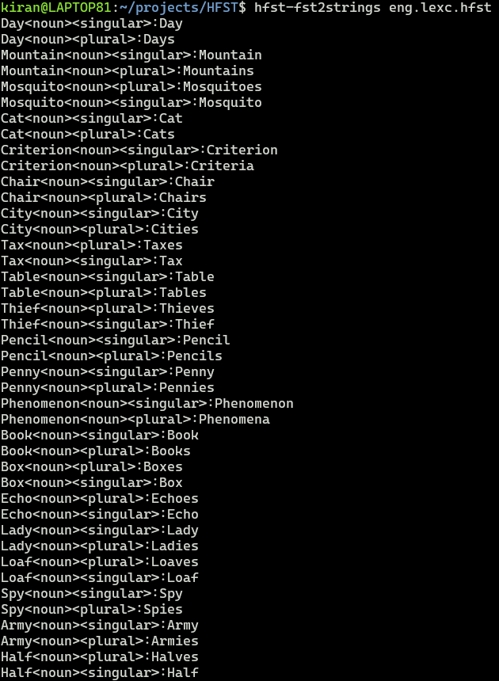
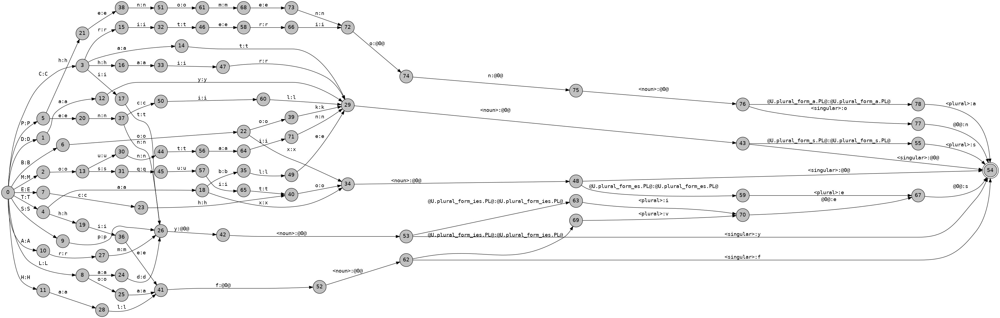
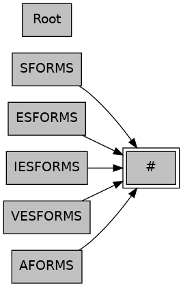

# Modelling morphology with finite-state transducers using HFST

## Compiling lexicon file
```
hfst-lexc eng.lexc -o eng.lexc.hfst

```
This command says to use the HFST lexc compiler to convert the lexicon file, `eng.lexc` into a binary representation and store the output in `eng.lexc.hfst`. 

We can print out the strings that the transducer covers, using the `hfst-fst2strings` command
```
hfst-fst2strings -X obey-flags eng.lexc.hfst 
```

The command should give the following output: 

## FST: 
```
hfst-fst2txt eng.lexc.hfst | python3 att2dot.py  | dot -Tpng -o eng.lexc.png
```
The command should give the following output: 

## Graph of continuation classes

```
cat eng.lexc | python3 lexc2dot.py | dot -Tpng -o eng-graph.lexc.png
```

The command should give the following output: 